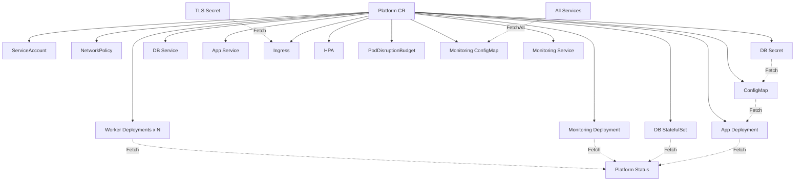

# Platform Operator Example

A single `Platform` custom resource produces **14 sub-resources** across 5 watched types — with zero manual watch wiring.

Open [`register.go`](register.go) to see the full dependency graph in one glance.

## Dependency graph



Solid arrows = direct dependency on the Platform spec.
Dashed arrows = runtime `Fetch`/`FetchAll` dependency tracked by the framework.

## What happens when the DB Secret changes?

1. **ConfigReconciler** re-runs — it `Fetch`ed the DB Secret to build the connection string.
2. The ConfigMap content changes (new password in the URL).
3. **AppDeploymentReconciler** re-runs — it `Fetch`ed the ConfigMap to compute the config hash annotation.
4. The Deployment's pod template annotation changes, triggering a rolling update.

Nothing else runs. No full reconcile. Four API calls total.

## What happens when you enable autoscaling?

1. You set `spec.autoscaling.enabled: true` on the Platform CR.
2. **AutoscalingReconciler** returns an HPA — framework creates it via server-side apply.
3. **PodDisruptionBudgetReconciler** returns a PDB — framework creates it. `minAvailable` is derived from `spec.autoscaling.minReplicas`.
4. All other reconcilers are unaffected. Two API calls.

Disable autoscaling and both return `nil` — framework deletes the HPA and PDB.

## Before / After

What this operator looks like in traditional controller-runtime vs make-reconcile.

**controller-runtime** (~250 lines of wiring + monolithic reconciler):

```go
func SetupController(mgr ctrl.Manager) error {
    return ctrl.NewControllerManagedBy(mgr).
        For(&Platform{}).
        Owns(&appsv1.Deployment{}).
        Owns(&appsv1.StatefulSet{}).
        Owns(&corev1.Service{}).
        Owns(&corev1.ConfigMap{}).
        Owns(&corev1.Secret{}).
        Owns(&corev1.ServiceAccount{}).
        Owns(&networkingv1.NetworkPolicy{}).
        Owns(&networkingv1.Ingress{}).
        Owns(&autoscalingv2.HorizontalPodAutoscaler{}).
        Owns(&policyv1.PodDisruptionBudget{}).
        Watches(&corev1.Secret{}, handler.EnqueueRequestsFromMapFunc(
            func(ctx context.Context, o client.Object) []reconcile.Request {
                // manually find Platforms referencing this Secret...
            },
        )).
        Watches(&corev1.ConfigMap{}, handler.EnqueueRequestsFromMapFunc(
            func(ctx context.Context, o client.Object) []reconcile.Request {
                // manually find Platforms referencing this ConfigMap...
            },
        )).
        Watches(&corev1.Service{}, handler.EnqueueRequestsFromMapFunc(
            func(ctx context.Context, o client.Object) []reconcile.Request {
                // manually find Platforms in this namespace...
            },
        )).
        Complete(&PlatformReconciler{})
}

func (r *PlatformReconciler) Reconcile(ctx context.Context, req ctrl.Request) (ctrl.Result, error) {
    var platform Platform
    if err := r.Get(ctx, req.NamespacedName, &platform); err != nil {
        return ctrl.Result{}, client.IgnoreNotFound(err)
    }

    // ServiceAccount
    desired := buildServiceAccount(&platform)
    if err := r.reconcileResource(ctx, &platform, desired); err != nil { ... }

    // NetworkPolicy
    desired = buildNetworkPolicy(&platform)
    if err := r.reconcileResource(ctx, &platform, desired); err != nil { ... }

    // DB Secret
    desired = buildDBSecret(&platform)
    if err := r.reconcileResource(ctx, &platform, desired); err != nil { ... }

    // ConfigMap (needs to read DB Secret first)
    var dbSecret corev1.Secret
    r.Get(ctx, types.NamespacedName{...}, &dbSecret)
    desired = buildConfigMap(&platform, &dbSecret)
    if err := r.reconcileResource(ctx, &platform, desired); err != nil { ... }

    // App Deployment (needs to read ConfigMap for hash)
    var cm corev1.ConfigMap
    r.Get(ctx, types.NamespacedName{...}, &cm)
    desired = buildAppDeployment(&platform, &cm)
    if err := r.reconcileResource(ctx, &platform, desired); err != nil { ... }

    // App Service
    // DB StatefulSet, DB Service
    // Ingress (conditional + read TLS Secret)
    // HPA (conditional)
    // PDB (conditional)
    // Monitoring ConfigMap, Deployment, Service (conditional + list all Services)
    // ... same pattern repeated 10 more times ...

    // Workers: list existing, diff against spec, create/delete
    // ... manual set reconciliation ...

    // Status: read back all Deployments, aggregate, patch
    // ...

    return ctrl.Result{}, nil
}

// Every resource needs a reconcileResource helper:
func (r *PlatformReconciler) reconcileResource(ctx context.Context, owner *Platform,
    desired client.Object) error {
    existing := desired.DeepCopyObject().(client.Object)
    err := r.Get(ctx, client.ObjectKeyFromObject(desired), existing)
    if apierrors.IsNotFound(err) {
        ctrl.SetControllerReference(owner, desired, r.Scheme)
        return r.Create(ctx, desired)
    }
    // diff desired vs existing, decide whether to update...
    ctrl.SetControllerReference(owner, desired, r.Scheme)
    return r.Update(ctx, desired)
}
// And a deleteIfDisabled helper for conditional resources...
// And manual set reconciliation for workers...
```

Everything re-runs on every event. A Secret change re-reconciles all 14 resources.

**make-reconcile** (22 lines in [`register.go`](register.go)):

```go
func RegisterAll(mgr *mr.Manager) {
    platforms   := mr.Watch[*Platform](mgr)
    secrets     := mr.Watch[*corev1.Secret](mgr)
    configMaps  := mr.Watch[*corev1.ConfigMap](mgr)
    services    := mr.Watch[*corev1.Service](mgr)
    deployments := mr.Watch[*appsv1.Deployment](mgr)

    mr.Reconcile(mgr, platforms, ServiceAccountReconciler)
    mr.Reconcile(mgr, platforms, NetworkPolicyReconciler)
    mr.Reconcile(mgr, platforms, DatabaseSecretReconciler)
    mr.Reconcile(mgr, platforms, ConfigReconciler(secrets))
    mr.Reconcile(mgr, platforms, AppDeploymentReconciler(configMaps))
    mr.Reconcile(mgr, platforms, AppServiceReconciler)
    mr.Reconcile(mgr, platforms, DatabaseStatefulSetReconciler)
    mr.Reconcile(mgr, platforms, DatabaseServiceReconciler)
    mr.Reconcile(mgr, platforms, IngressReconciler(secrets))
    mr.Reconcile(mgr, platforms, AutoscalingReconciler)
    mr.Reconcile(mgr, platforms, PodDisruptionBudgetReconciler)
    mr.Reconcile(mgr, platforms, MonitoringConfigMapReconciler(services))
    mr.Reconcile(mgr, platforms, MonitoringDeploymentReconciler)
    mr.Reconcile(mgr, platforms, MonitoringServiceReconciler)
    mr.ReconcileMany(mgr, platforms, WorkersReconciler)
    mr.ReconcileStatus(mgr, platforms, StatusReconciler(deployments))
}
```

A Secret change re-runs only the 1-2 reconcilers that `Fetch`ed it. No manual watch wiring, no diff logic, no delete helpers. Each handler is a pure function under 50 lines.

## Anatomy of register.go

```
Watch declarations       5 lines — all resource types the operator cares about
Reconcile calls         14 lines — each one names the handler, visible at a glance
ReconcileMany            1 line  — dynamic worker set
ReconcileStatus          1 line  — aggregated health, runs after all outputs
```

Handler patterns used:

| Pattern | Example | When |
|---------|---------|------|
| Named function | `ServiceAccountReconciler` | No extra dependencies beyond the Platform |
| Factory (closure) | `ConfigReconciler(secrets)` | Handler needs to `Fetch` from another collection |

## Counts

- **14** sub-reconcilers (12 `Reconcile` + 1 `ReconcileMany` + 1 `ReconcileStatus`)
- **5** resource types watched (`Platform`, `Secret`, `ConfigMap`, `Service`, `Deployment`)
- **0** manual watch wiring or event handler boilerplate
